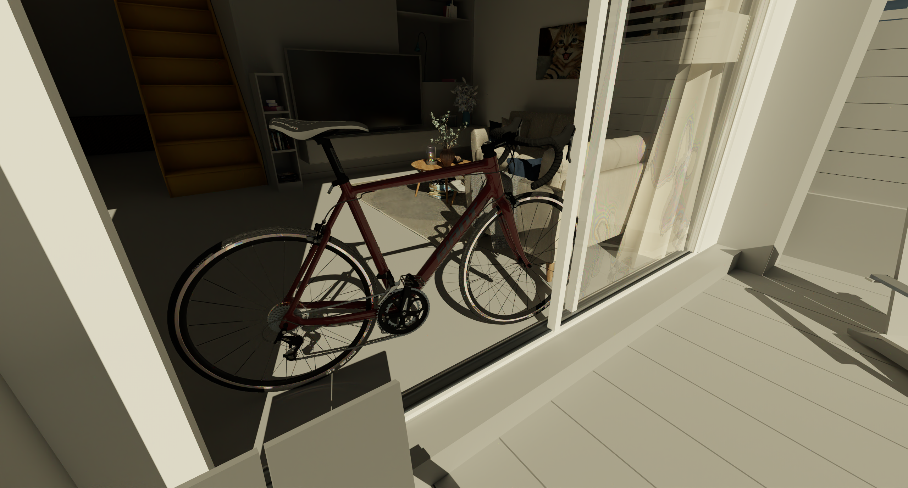

# Real-time physical light transport (PLT) framework

This repository demonstrates interactive wave-optical rendering, and implements core concepts from the PLT series of publications. See relevant papers:
- [A Generalized Ray Formulation For Wave-Optics Rendering]()
- [Towards Practical Physical-Optics Rendering](https://ssteinberg.xyz/2022/04/03/practical_plt/)
- [Physical Light-Matter Interaction in Hermite-Gauss Space](https://ssteinberg.xyz/2021/07/31/physical_light_matter_interaction_hg_space/)
- [A Generic Framework for Physical Light Transport](https://ssteinberg.xyz/2021/04/26/generic_physical_light_transport_framework/)

Path tracing is done unidirectionally with **generalized rays** (wave-optical constructs which generalize the classical rays typically used in rendering to wave optics).
The renderer is spectral (with spectral MIS) and polarimetric.

All materials are diffractive, polarization-aware and optical coherence aware.
The following PLT materials are implemented:
- Dielectrics
- Conductors
- Coated dielectrics
- Coated conductors
- Diffraction-grated dielectrics
- Diffraction-grated conductors
- Birefringent thin dielectrics
- Alternating multi-layered stacks on a dielectric

All surfaces allow arbitrary roughness (coherence-aware, first-order SPM with a K-Correlation PSD), modelled to match the "look-and-feel" of microfacet GGX roughness, but with correct physics.
All conductors use tabulated spectral refractive-indices, and all light sources use spectral emission tables of real light sources (see 'Source/Tables' for tabulated data). Light emission data is from [LSPDD](https://lspdd.org).

Manifold sampling (MS) is implemented. MS enables exploring NEE connections through dielectrics, as well as NEE with a delta lobe. This is used to render the dispersive lobes of a diffraction grating, as demonstrated in the images below.

A few sample scenes with diffractive materials can be found [here]().
Other PBRT, Falcor and mitsuba scenes can be loaded (PBRT and mitsuba importers with limited support), and materials are automatically converted to PLT materials.

Builds upon the **Falcor** real-time rendering framework.
For more information and additional resources, see the [Falcor GitHub page](https://github.com/NVIDIAGameWorks/Falcor).





Additional rendered images and videos available [here]().


## Usage
- Run **Mogwai**
- Load script **'scripts/PLTPathTracer.py'** (or **'scripts/PLTPathTracerNoDenoiser.py'**)
- Load a scene

To use the OptiX denoiser, OptiX and Cuda should be installed. See below.

## Prerequisites
- Windows 10 version 20H2 (October 2020 Update) or newer, OS build revision .789 or newer
- Visual Studio 2019
- [Windows 10 SDK (10.0.19041.0) for Windows 10, version 2004](https://developer.microsoft.com/en-us/windows/downloads/windows-10-sdk/)
- A GPU which supports DirectX Raytracing, such as the NVIDIA Titan V or GeForce RTX
- NVIDIA driver 466.11 or newer

** **Note:** There is a bug with some NVIDIA drivers (confirmed with 528.49) where manifold sampling (when enabled) fails for the first few hundred or thousand frames, and kicks in afterwards. This is under investigation.

## Building
Falcor uses the [CMake](https://cmake.org) build system. Additional information on how to use Falcor with CMake is available in the [CMake](docs/development/cmake.md) development documetation page.

### Visual Studio
If you are working with Visual Studio, you can setup a native Visual Studio solution by running `setup_vs2019.bat` (or `setup_vs2022.bat`, same process) after cloning this repository. The solution files are written to `build/windows-vs2019` and the binary output is located in `build/windows-vs2019/bin`.


### Visual Studio Code
If you are working with Visual Studio Code, run `setup.bat` after cloning this repository. This will setup a VS Code workspace in the `.vscode` folder with sensible defaults (only if `.vscode` does not exist yet). When opening the project folder in VS Code, it will prompt to install recommended extensions. We recommend you do, but at least make sure that _CMake Tools_ is installed. To build Falcor, you can select the configure preset by executing the _CMake: Select Configure Preset_ action (Ctrl+Shift+P). Choose the _Windows Ninja/MSVC_ preset (or one for a different rendering backend). Then simply hit _Build_ (or press F7) to build the project. The binary output is located in `build/windows-ninja-msvc/bin`.

Warning: Do not start VS Code from _Git Bash_, it will modify the `PATH` environment variable to an incompatible format, leading to issues with CMake.

### Configure Presets
Falcor uses _CMake Presets_ store in `CMakePresets.json` to provide a set of commonly used build configurations. You can get the full list of available configure presets running `cmake --list-presets`:

```
$ cmake --list-presets
Available configure presets:

  "windows-vs2019"           - Windows VS2019
  "windows-vs2022"           - Windows VS2022
  "windows-ninja-msvc"       - Windows Ninja/MSVC
  "linux-ninja-clang"        - Linux Ninja/Clang
```

Use `cmake --preset <preset name>` to generate the build tree for a given preset. The build tree is written to the `build/<preset name>` folder and the binary output files are in `build/<preset name>/bin`.

An existing build tree can be compiled using `cmake --build build/<preset name>`.

Note: Some render passes (RTXGI, RTXDI, DLSS in particular) are not fully working with the new Slang GFX backend.

## Microsoft DirectX 12 Agility SDK
Falcor uses the [Microsoft DirectX 12 Agility SDK](https://devblogs.microsoft.com/directx/directx12agility/) to get access to the latest DirectX 12 features. Applications can enable the Agility SDK by putting `FALCOR_EXPORT_D3D12_AGILITY_SDK` in the main `.cpp` file. `Mogwai`, `FalcorTest` and `RenderGraphEditor` have the Agility SDK enabled by default.

## NVAPI
To enable NVAPI support, head over to https://developer.nvidia.com/nvapi and download the latest version of NVAPI (this build is tested against version R520).
Extract the content of the zip file into `external/packman/` and rename `R520-developer` to `nvapi`.

## CUDA
To enable CUDA support, download and install [CUDA 11.6.2](https://developer.nvidia.com/cuda-11-6-2-download-archive) or later and reconfigure the build.

See the `CudaInterop` sample application located in `Source/Samples/CudaInterop` for an example of how to use CUDA.

## OptiX
If you want to use Falcor's OptiX functionality (specifically the `OptixDenoiser` render pass) download the [OptiX SDK](https://developer.nvidia.com/designworks/optix/download) (Falcor is currently tested against OptiX version 7.6) After running the installer, link or copy the OptiX SDK folder into `external/packman/optix` (i.e., file `external/packman/optix/include/optix.h` should exist).

Note: You also need CUDA installed to compile the `OptixDenoiser` render pass, see above for details.

## Resources
- [Falcor](https://github.com/NVIDIAGameWorks/Falcor): Falcor's GitHub page.
- [Documentation](./docs/index.md): Additional information and tutorials.
    - [Getting Started](./docs/getting-started.md)
    - [Render Graph Tutorials](./docs/tutorials/index.md)
- [Rendering Resources](https://benedikt-bitterli.me/resources) A collection of scenes loadable in Falcor (pbrt-v4 format).
- [ORCA](https://developer.nvidia.com/orca): A collection of scenes and assets optimized for Falcor.
- [Slang](https://github.com/shader-slang/slang): Falcor's shading language and compiler.

---

<a rel="license" href="http://creativecommons.org/licenses/by-nc/4.0/"></a><br />This work is licensed under a <a rel="license" href="http://creativecommons.org/licenses/by-nc/4.0/">Creative Commons Attribution-NonCommercial 4.0 International License</a>.
